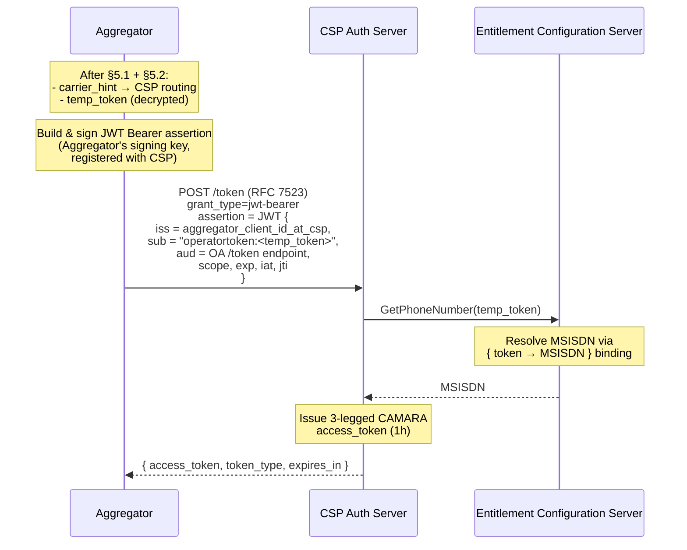
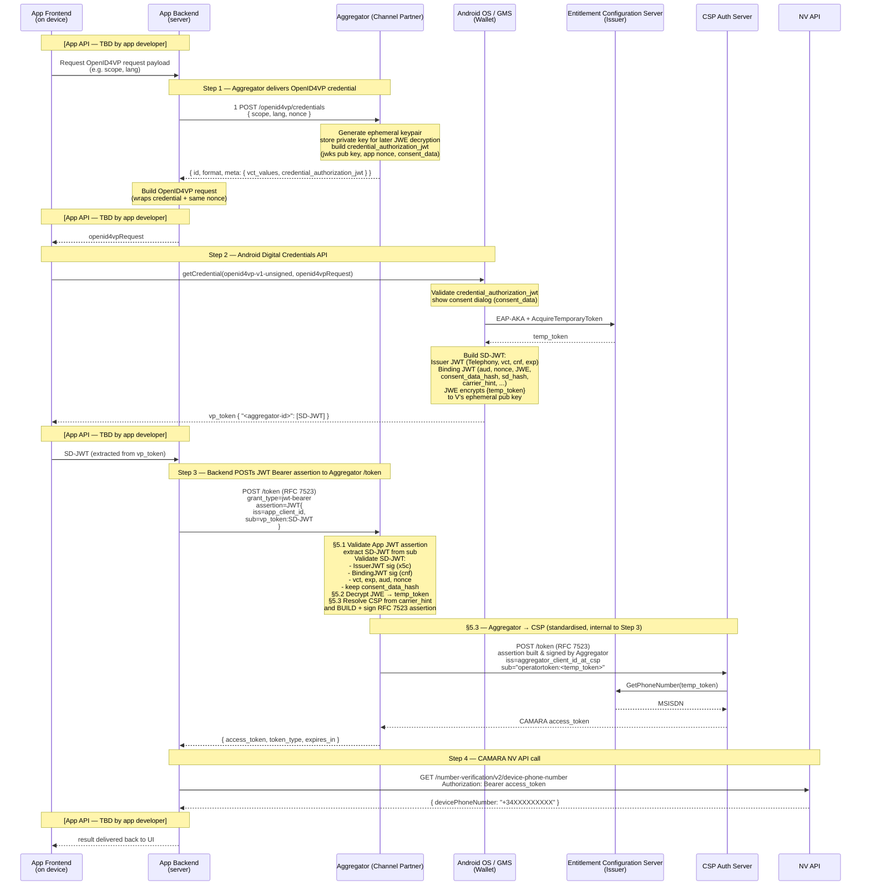

# CAMARA Number Verification — Operator Token Acquisition
## Companion Guide to CAMARA NV API 2.1

| Field | Value |
|---|---|
| **Document version** | 0.1 |
| **Status** | DRAFT — for review and discussion |
| **Document type** | Informative guide (non-normative). See "Status of this document" in §1. |
| **Date** | 2026-06-25 |
| **Scope** | Android (TS.43 / GMS path) |
| **Relation to CAMARA NV 2.1** | This document describes how to obtain the `operatorToken` and use it within the CAMARA NV 2.1 JWT Bearer authentication flow. It is informative: it does not modify or replace any normative requirement of CAMARA NV 2.1, and it introduces no new normative requirements of its own. |
| **Naming note** | To avoid confusion, the `sub` claim label was disambiguated between the two hops: on the Application → Aggregator hop it is named `vp_token` (it carries the OpenID4VP `vp_token` / SD-JWT), while the Aggregator → operator (CSP) hop keeps `operatortoken` (it carries the actual Operator Token). This is a naming change only, made purely to disambiguate the two hops; it does not alter the flow or the scope of the document. |

---

## Table of Contents

- [1. Introduction](#1-introduction)
  - [1.1 Intended audience](#11-intended-audience)
  - [1.2 Normative references](#12-normative-references)
  - [1.3 Abbreviations](#13-abbreviations)
  - [1.4 Glossary of Terms and Concepts](#14-glossary-of-terms-and-concepts)
- [2. Roles and Terminology](#2-roles-and-terminology)
  - [2.1 OpenID4VP roles](#21-openid4vp-roles)
  - [2.2 Note on "Aggregator" / "Channel Partner" terminology](#22-note-on-aggregator--channel-partner-terminology)
  - [2.3 CSP](#23-csp)
  - [2.4 GMS](#24-gms)
- [3. End-to-End Flow Overview](#3-end-to-end-flow-overview)
- [4. Full End-to-End Flow](#4-full-end-to-end-flow)
  - [Step 1 — Carrier eligibility check and OpenID4VP credential acquisition](#step-1--carrier-eligibility-check-and-openid4vp-credential-acquisition)
  - [Step 2 — Request the Operator Token via Android Digital Credentials API](#step-2--request-the-operator-token-via-android-digital-credentials-api)
  - [Step 3 — Exchange the Operator Token for a CAMARA access token at the Aggregator](#step-3--exchange-the-operator-token-for-a-camara-access-token-at-the-aggregator)
  - [Step 4 — Call the CAMARA NV API](#step-4--call-the-camara-nv-api)
- [5. Aggregator (Channel Partner) Internal Responsibilities](#5-aggregator-channel-partner-internal-responsibilities)
  - [5.1 Application assertion validation and SD-JWT processing](#51-application-assertion-validation-and-sd-jwt-processing)
  - [5.2 JWE decryption (encrypted_credential → temp_token)](#52-jwe-decryption-encrypted_credential--temp_token)
  - [5.3 Aggregator → CSP JWT Bearer flow (standardised)](#53-aggregator--csp-jwt-bearer-flow-standardised)
- [6. Error handling](#6-error-handling)
- [7. Required Android permissions](#7-required-android-permissions)
- [8. Security Considerations](#8-security-considerations)
- [Appendix A — End-to-end sequence diagram](#appendix-a--end-to-end-sequence-diagram)
- [Appendix B — Aggregator credential_authorization_jwt structure](#appendix-b--aggregator-credential_authorization_jwt-structure)
  - [B.1 Trust anchor — Aggregator onboarding / whitelisting on Android by CSPs](#b1-trust-anchor--aggregator-onboarding--whitelisting-on-android-by-csps)

---

## 1. Introduction

CAMARA Number Verification API 2.1 supports JWT Bearer with Operator Token as the authentication mode for accessing the NV endpoints. This mode requires the caller to hold a valid `operatorToken`. CAMARA NV 2.1 does not specify how that token is obtained. This document fills that gap for the Android platform using the TS.43 / GMS path via the OpenID4VP Digital Credentials API.

This guide describes two interfaces:

- **App ↔ Aggregator (Channel Partner):** two endpoints exposed by the Aggregator to the Application — `/openid4vp/credentials` (bootstrap: delivers the OpenID4VP credential the App will pass to Android) and `/token` (the Application builds and signs a JWT Bearer assertion (RFC 7523) carrying the Operator Token (SD-JWT from Step 2) in the `sub` claim as `"vp_token:<SD-JWT>"`; the Aggregator validates the assertion, extracts and decrypts the SD-JWT, and returns a CAMARA access token).
- **Aggregator ↔ Operator Auth Server (CSP):** the RFC 7523 JWT Bearer call by which the **Aggregator** (after validating and decrypting the SD-JWT) exchanges the carrier-issued `temp_token` for a CAMARA access token. The JWT Bearer assertion at this hop is **built and signed by the Aggregator**, with `sub` formatted as `operatortoken:<temp_token>` and `iss` set to the Aggregator's `client_id` registered with that CSP.

Application authentication against the Aggregator is **not** described here — each Aggregator may use its own scheme.

The Operator Token (SD-JWT) returned by Android is **both signed and encrypted** at the data layer that matters: the carrier-issued `temp_token` is wrapped inside a JWE (RFC 7516, ECDH-ES + A128GCM) that only the Aggregator can decrypt — using the ephemeral private key it generated and kept when serving the credential in Step 1. The Application therefore cannot read the `temp_token` even though it carries the SD-JWT through.

> **Status of this document.** This is an **informative guide**. It carries no normative force within CAMARA and introduces no requirements beyond those already defined in CAMARA NV 2.1. The RFC 2119 keywords used below (see §1.2) describe the **recommended** way to implement the approach set out here; they are not CAMARA-mandated obligations. Where the guide says an interface is "described" or "recommended", it is offering a concrete, interoperable option — it is not asserting a conformance requirement. The two interfaces above are documented so that independent implementations can interoperate; whether any part of this guide is later promoted to a normative CAMARA artefact is a separate decision for the working group.

### 1.1 Intended audience

Application developers and Aggregators (Open Gateway Channel Partners) implementers who need to build the end-to-end Number Verification flow on Android using an Operator Token.

### 1.2 Normative references

The key words "MUST", "MUST NOT", "REQUIRED", "SHALL", "SHALL NOT", "SHOULD", "SHOULD NOT", "RECOMMENDED", "MAY", and "OPTIONAL" in this document are to be interpreted as described in [RFC 2119](https://www.rfc-editor.org/rfc/rfc2119).

| Reference | Title |
|---|---|
| **CAMARA NV 2.1** | [CAMARA Number Verification API 2.1](https://github.com/camaraproject/NumberVerification/blob/r3.2/code/API_definitions/number-verification.yaml) |
| **GSMA TS.43** | [Service Entitlement Configuration, v13.0](https://www.gsma.com/get-involved/working-groups/wp-content/uploads/2026/02/TS.43v13.0-Service-Entitlement-Configuration.pdf) |
| **OID4VP** | [OpenID for Verifiable Presentations 1.0](https://openid.net/specs/openid-4-verifiable-presentations-1_0.html) |
| **W3C Digital Credentials API** | [Digital Credentials API (CG Draft)](https://w3c-fedid.github.io/digital-credentials/) |
| **RFC 2119** | [Key words for use in RFCs to Indicate Requirement Levels](https://www.rfc-editor.org/rfc/rfc2119) |
| **RFC 7515** | [JSON Web Signature (JWS)](https://www.rfc-editor.org/rfc/rfc7515) |
| **RFC 7516** | [JSON Web Encryption (JWE)](https://www.rfc-editor.org/rfc/rfc7516) |
| **RFC 7518** | [JSON Web Algorithms (JWA) — §4.6 ECDH-ES](https://www.rfc-editor.org/rfc/rfc7518) |
| **RFC 7519** | [JSON Web Token (JWT)](https://www.rfc-editor.org/rfc/rfc7519) |
| **RFC 7521** | [Assertion Framework for OAuth 2.0](https://www.rfc-editor.org/rfc/rfc7521) |
| **RFC 7523** | [JWT Profile for OAuth 2.0 Client Authentication and Authorization Grants](https://www.rfc-editor.org/rfc/rfc7523) |
| **Android PNV guide** | [Phone Number Verification with Digital Credentials](https://developer.android.com/identity/digital-credentials/phone-number-verification) |
| **CAMARA ICM JWT Bearer Flow** | [CAMARA Identity and Consent Management — JWT Bearer Flow](https://github.com/camaraproject/IdentityAndConsentManagement/blob/r4.2/documentation/CAMARA-API-access-and-user-consent.md#jwt-bearer-flow) |

### 1.3 Abbreviations

| Abbreviation | Meaning |
|---|---|
| **AKA** | Authentication and Key Agreement |
| **CSP** | Communication Service Provider |
| **DCQL** | Digital Credential Query Language |
| **EAP** | Extensible Authentication Protocol |
| **EAP-AKA** | EAP Method for UMTS Authentication and Key Agreement (RFC 4187) |
| **EPK** | Ephemeral Public Key |
| **ECS** | Entitlement Configuration Server |
| **GMS** | Google Mobile Services |
| **JWA** | JSON Web Algorithms (RFC 7518) |
| **JWE** | JSON Web Encryption (RFC 7516) |
| **JWS** | JSON Web Signature (RFC 7515) |
| **JWT** | JSON Web Token (RFC 7519) |
| **MCC** | Mobile Country Code |
| **MNC** | Mobile Network Code |
| **MSISDN** | Mobile Station International Subscriber Directory Number |
| **NV** | Number Verification |
| **OA** | OAuth Authorization Server (CSP Auth Server) |
| **OID4VP** | OpenID for Verifiable Presentations |
| **SD-JWT** | Selective Disclosure JSON Web Token |
| **SIM** | Subscriber Identity Module |
| **TS.43** | GSMA Service Entitlement Configuration specification |
| **vct** | Verifiable Credential Type |
| **VP** | Verifiable Presentation |

### 1.4 Glossary of Terms and Concepts

| Term | Definition |
|---|---|
| **Aggregator** | The cloud-side entity (also called Channel Partner or Verifier) that exposes CAMARA-compliant endpoints to the Application, holds the ephemeral private key for JWE decryption, and exchanges the `temp_token` with the CSP via RFC 7523. Equivalent to **API Provider** in CAMARA Commonalities terminology (the software component that exposes CAMARA APIs on the platform side). |
| **Application** | The mobile or web client that initiates the Number Verification flow on behalf of the end user. Equivalent to **API Consumer** in CAMARA terminology. |
| **Binding JWT** | The second component of the SD-JWT (`<Issuer JWT>~<Binding JWT>`), signed by the device key referenced in the Issuer JWT `cnf` claim. It carries the `nonce`, `aud`, `consent_data_hash`, `sd_hash`, `carrier_hint`, and the `encrypted_credential` JWE. |
| **Channel Partner** | Open Gateway term for the Aggregator. See **Aggregator**. |
| **consent_data_hash** | SHA-256 hash of the `consent_data` field from the `credential_authorization_jwt`, included in the Binding JWT as a verifiable record that the consent dialog was displayed to the user. |
| **credential_authorization_jwt** | JWS signed by the Aggregator that serves as: (1) proof of authorisation to request an Operator Token, (2) carrier for the Aggregator's ephemeral encryption public key, and (3) source of the consent text shown in the Android system dialog. |
| **CSP** | Communication Service Provider — the operator that owns the end-user's mobile subscription and ultimately validates the `temp_token` to issue the CAMARA access token. |
| **Ephemeral keypair** | An EC keypair (P-256) generated fresh by the Aggregator for each `/openid4vp/credentials` request. The public key is embedded in the `credential_authorization_jwt` `jwks`; the private key is retained solely for JWE decryption in §5.2 and discarded immediately after. |
| **Issuer JWT** | The first component of the SD-JWT, signed by Android Telephony. It carries `iss = "Telephony"`, the `vct`, and the `cnf` key binding for the Binding JWT. |
| **Operator Token** | An Android platform and CAMARA NV 2.1 term — **not defined in GSMA TS.43**. The SD-JWT credential (`<Issuer JWT>~<Binding JWT>`) assembled by Android Telephony and returned in the OpenID4VP `vp_token`. It is the transport structure for the TS.43 Temporary Token (`temp_token`): the Issuer JWT (signed by Android Telephony, `iss = "Telephony"`) asserts the credential type (`vct`) and device key binding (`cnf`); the Binding JWT carries the nonce, consent hash, carrier identification, and the Temporary Token encrypted in the `encrypted_credential` JWE. The Application embeds it in the `sub` claim of the JWT Bearer assertion (`"vp_token:<SD-JWT>"`) that it sends to the Aggregator in Step 3. |
| **SD-JWT** | Selective Disclosure JSON Web Token. In this document, the two-part structure `<Issuer JWT>~<Binding JWT>` returned by Android in the `vp_token`. |
| **temp_token** | The **Temporary Token** as defined in GSMA TS.43 §2.8.6: a token issued by the Entitlement Configuration Server (ECS) and handed to the client (Android / GMS) to be passed to a third party — the Aggregator (Application Server in TS.43 terms) — for authentication on the ECS. The ECS maintains the binding `{TemporaryToken → MSISDN}`. In Android's implementation it is encrypted inside the `encrypted_credential` JWE (ECDH-ES + A128GCM) within the Binding JWT, readable only by the Aggregator. The Aggregator decrypts it in §5.2 and submits it to the CSP Auth Server in §5.3 as the `sub` claim of the JWT Bearer assertion (`sub = "operatortoken:<temp_token>"`). |
| **vp_token** | The OpenID4VP response field containing the SD-JWT, keyed by the Aggregator's `id` from the DCQL credential object. The same term is reused as the `sub` prefix (`vp_token:<SD-JWT>`) on the App → Aggregator hop (Step 3), identifying the subject as this OpenID4VP presentation. |

---

## 2. Roles and Terminology

### 2.1 OpenID4VP roles

| Role | OpenID4VP definition | In this document |
|---|---|---|
| **Verifier** | Entity that requests, receives, and validates Presentations. Specific case of an OAuth 2.0 Client. | The backend service (Aggregator / Channel Partner) that exposes CAMARA-compliant endpoints to the Application. Internally adapts the TS.43 credential to obtain a CAMARA access token from the CSP. |
| **Wallet** | Entity used by the Holder to receive, store, present, and manage Credentials. | Android OS / Google Play Services (GMS). Manages the TS.43 interaction with the Entitlement  Configuration Server (ECS). |
| **Holder** | Entity that receives Credentials and has control over them. | The end user's Android device. |
| **Issuer** | Entity that issues Verifiable Credentials to the Holder. | Android Telephony (`iss = "Telephony"` in the Issuer JWT). The TS.43 `temp_token` is contributed by the Entitlement Configuration Server (ECS) but encapsulated by Android. |

### 2.2 Note on "Aggregator" / "Channel Partner" terminology

In Android platform documentation the **Verifier** role is referred to as the **Aggregator**. In the Open Gateway terminology it is referred to as the **Channel Partner**. The three terms denote the same entity in this document; **Aggregator** is used as the primary term throughout. **Verifier** appears only where the OpenID4VP protocol role is specifically relevant; note that Google's own documentation uses "Verifier" to mean the Application (not the cloud service), which is the inverse of the OpenID4VP definition — see the note below.

> **Note on Google's terminology** — Google's *"Digital Credentials API for Phone Number Verification"* uses **Verifier** to refer to the *application or website* requesting the credential, and **Aggregator** for the cloud service that prepares the OpenID4VP credential and decrypts the response. In OpenID4VP terms the cryptographic Verifier role (signing the request, decrypting the response) lives on the cloud side — i.e. what this document calls the Verifier. To avoid confusion, in this document **Verifier ≡ Aggregator ≡ Channel Partner** (the cloud entity), and the application is consistently called **Application** (or App).

### 2.3 CSP

**CSP** (Communication Service Provider) refers to the mobile operator that owns the end-user's mobile subscription. In this document the term is used collectively to refer to the operator's network-side components: its Auth Server (OA), which issues CAMARA access tokens, and its Entitlement Configuration Server (ECS), which maintains the `{temp_token → MSISDN}` binding.

### 2.4 GMS

**GMS** (Google Mobile Services) is Google's proprietary suite that ships on Play-certified Android devices. In this document GMS is the concrete implementation of the OpenID4VP **Wallet** role: it provides the `CredentialManager` API (and the underlying Digital Credentials API on the web via Chrome), drives the OS consent dialog, runs the EAP-AKA exchange and TS.43 acquisition with the Entitlement Configuration Server (ECS) through Android Telephony, and assembles the resulting SD-JWT (Issuer JWT + Binding JWT, with the carrier `temp_token` wrapped in the JWE) that is returned in the `vp_token`. The flow described here therefore requires a Play-certified Android device with an up-to-date GMS supporting the Digital Credentials API; AOSP-only devices without GMS are out of scope.

---

## 3. End-to-End Flow Overview

  ```mermaid
  sequenceDiagram
      participant App as Application
      participant V as Aggregator
      participant GMS as Android OS / GMS
      participant ECS as Entitlement Configuration Server
      participant OA as CSP Auth Server
      participant NV as NV API

      App->>V: ① POST /openid4vp/credentials
      V-->>App: credential_authorization_jwt

      App->>GMS: ② getCredential(openid4vpRequest)
      GMS->>ECS: EAP-AKA
      ECS-->>GMS: temp_token
      GMS-->>App: vp_token: SD-JWT

      App->>V: ③ POST /token<br/>assertion = JWT {sub=vp_token:SD-JWT}
      V->>OA: POST /token (RFC 7523)<br/>sub = operatortoken:temp_token
      OA->>ECS: GetPhoneNumber(temp_token)
      ECS-->>OA: MSISDN
      OA-->>V: CAMARA access_token
      V-->>App: access_token

      App->>NV: ④ GET /device-phone-number
      NV-->>App: devicePhoneNumber
  ```

The Application interacts exclusively with standard CAMARA-shaped interfaces. The Aggregator owns JWE decryption (using the ephemeral private key generated in Step ①) and the internal RFC 7523 assertion toward the CSP. This Aggregator (Channel Partner) model follows the GSMA [Open Gateway Technical Realisation Guidelines (OPG.10 v4.0)](https://www.gsma.com/solutions-and-impact/technologies/networks/wp-content/uploads/2012/10/OPG.10-v4.0-Open-Gateway-Technical-Realisation-Guidelines.pdf).

---

## 4. Full End-to-End Flow

### Step 1 — Carrier eligibility check and OpenID4VP credential acquisition

This step combines a **silent pre-flight eligibility check** with the retrieval of the OpenID4VP credential in a single round-trip to the Aggregator. No consent dialog, no OS permission prompt, and no visible indication to the user occurs at this stage. The Aggregator evaluates whether any of the device's active SIMs is eligible for Operator Token and, if so, returns the credential the Application needs to proceed. If not, it returns fallback options. The user only sees a screen in Step 2, and only if eligibility is confirmed here.

#### Step 1.1 Read carrier IDs from the device (silent, permission-free)

Before calling the Aggregator, the Application reads the carrier ID for each active SIM slot using the `activeCarrierIds()` extension function. This function is **permission-free** — it requires no runtime permission for either the carrier ID lookup or the slot enumeration.

```kotlin
fun Context.activeCarrierIds(): List<Int> {
    val tm = getSystemService(Context.TELEPHONY_SERVICE) as TelephonyManager

    if (Build.VERSION.SDK_INT < Build.VERSION_CODES.Q) {
        return listOf(tm.simCarrierId)
            .filter { it != TelephonyManager.UNKNOWN_CARRIER_ID }
    }

    val slotCount =
        if (Build.VERSION.SDK_INT >= Build.VERSION_CODES.R) tm.activeModemCount
        else @Suppress("DEPRECATION") tm.phoneCount

    return (0 until slotCount)
        .map { slot -> SubscriptionManager.getSubscriptionId(slot) }
        .filter(SubscriptionManager::isValidSubscriptionId)
        .map { subId -> tm.createForSubscriptionId(subId).simCarrierId }
        .filter { it != TelephonyManager.UNKNOWN_CARRIER_ID }
        .distinct()
}
```

> This implementation supports dual-SIM devices — devices with more than one physical SIM card or eSIM active simultaneously. It enumerates all active modem slots (API 30+ via `activeModemCount`) or phone slots (API 29 via `phoneCount`) and returns one distinct carrier ID per eligible SIM. On single-SIM devices the list contains at most one entry. No runtime permission is required: `TelephonyManager.simCarrierId` and `SubscriptionManager.getSubscriptionId(slot)` are both permission-free; `READ_PHONE_STATE` is never accessed.

If the Application has previously completed a successful Operator Token flow on this device (e.g. the carrier ID was persisted locally), it MAY filter `carrierIds` to just the previously used value to express a preference. This is optional and purely a UX optimisation.

#### Step 1.2 Request (Application → Aggregator)

The Application POSTs to `/openid4vp/credentials` including the carrier ID list. The Aggregator checks the list against its per-CSP allowlist and, if at least one carrier is eligible, generates the OpenID4VP credential and returns it directly. **This is a single call — there is no separate eligibility endpoint.**

> **Note:** The `/openid4vp/credentials` endpoint shape is **described by this guide as a recommended shape**; authentication against it is **Aggregator-specific** (mTLS, OAuth client credentials, JWT bearer with Aggregator-issued keys, etc., per Aggregator).

```http
POST /openid4vp/credentials HTTP/1.1
Host: <aggregator-host>
Authorization: <aggregator-specific>
Content-Type: application/json

{
  "scope": "openid dpv:ServiceProvision number-verification:device-phone-number:read",
  "lang": "pt-BR",
  "nonce": "<app-generated nonce>",
  "carrier_ids": [1839, 1840]
}
```

> **Parameter placement:** `scope`, `lang`, `nonce`, `carrier_ids` travel in the **JSON request body**. `Authorization` and `Content-Type` are HTTP headers. Nothing in the query string.

| Field | Description |
|---|---|
| `scope` | CAMARA scope identifying the requested operation. Using the CAMARA scope (rather than a platform-specific credential type) keeps this interface platform-agnostic. |
| `lang` | BCP 47 language tag. The Aggregator (Channel Partner) uses this to return consent text in the appropriate language. |
| `nonce` | Application-generated value. Single-use. The Application keeps it and uses it to correlate the eventual response. The Aggregator (Channel Partner) SHALL embed this same value in the `credential_authorization_jwt` payload — it ends up in the Binding JWT and the Aggregator (Channel Partner) validates it on the way back in Step 3. |
| `carrier_ids` | Array of Android canonical carrier IDs returned by `activeCarrierIds()` — one entry per active SIM slot. The Aggregator uses this list solely to determine eligibility before generating the credential; it does NOT use it for CSP routing after the flow completes (see Step 1.4 below). |

#### Step 1.3 Aggregator response: eligible or fallback

**Eligible path** — at least one of the presented carrier IDs is in the Aggregator's allowlist. The Aggregator generates the OpenID4VP credential and returns it immediately. The Application proceeds to Step 2.

**Response — OpenID4VP credential (DCQL credential object)**

```json
{
  "id": "<aggregator-id>",
  "format": "dc-authorization+sd-jwt",
  "meta": {
    "vct_values": ["number-verification/device-phone-number/ts43"],
    "credential_authorization_jwt": "<JWS signed by Aggregator — see Appendix B>"
  }
}
```

| Field | Description |
|---|---|
| `id` | Aggregator-chosen unique identifier. Used by the Application to extract the SD-JWT from the Android `vp_token`. |
| `format` | Fixed: `"dc-authorization+sd-jwt"`. |
| `vct_values` | Array containing the **Google-defined TS.43 credential type identifier** (slash-separated form) that corresponds to the CAMARA scope from the request. This is *not* a CAMARA scope — it is the Verifiable Credential Type (`vct`) that Android Telephony will stamp into the Issuer JWT. The Aggregator (Channel Partner) maps from the CAMARA `scope` in the request to the appropriate `vct_values` here. |
| `credential_authorization_jwt` | JWS signed by the Aggregator (Channel Partner) with the private key whose certificate chain (`x5c`) sits in its header. It is the **Aggregator's proof of authorisation** to request an Operator Token for the SIM's CSP, and bundles three things in one signed object: **(1) authorisation** — GMS verifies the signature *and* matches the SHA-256 fingerprint of the chain's root certificate against the per-CSP Aggregator whitelist registered with Google out of band (see **Appendix B.1**); **(2) response confidentiality setup** — the `jwks` carries the Aggregator's ephemeral encryption public key that Telephony will use to encrypt the `temp_token` JWE in the Binding JWT (§5.2); **(3) user consent** — `consent_data` carries the text shown by Android in the system consent dialog, its `nonce` echoes the app-passed value, and its hash later reappears as `consent_data_hash` in the Binding JWT. See **Appendix B** for the full structure. |

**Fallback path** — none of the presented carrier IDs is in the Aggregator's allowlist. The Aggregator SHOULD return an error response, optionally indicating available alternative authentication methods. **No credential is generated and the Application SHALL NOT proceed to Step 2.**

```json
{
  "error": "carrier_not_supported",
  "error_description": "None of the provided carrier IDs are eligible for Operator Token.",
  "fallback_options": ["sms_otp", "totp"]
}
```

The Application uses this signal to select an alternative flow without ever having shown the user a consent dialog or any NV-specific UI. The user experience is seamless: if Operator Token is not available, the app falls back silently before any OS interaction occurs.

#### Step 1.4 What the user sees in Step 2 — and why the carrier_hint inside the token governs routing

When the Application proceeds to Step 2 using the credential returned above, Android presents a **native system consent dialog** to the user. This dialog:

- Is shown by the OS (not the Application) and cannot be suppressed or bypassed.
- Lists **only the SIM cards whose carrier has both enabled Operator Token support and whitelisted this Aggregator** (Appendix B.1). SIMs from carriers that have not onboarded with this Aggregator are not shown, even if physically present in the device.
- Allows the user to **select which SIM to use** if more than one eligible SIM is available, or to **decline** the operation entirely.

This means the SIM the user selects in Step 2 **may differ from the SIM whose carrier ID was sent in the eligibility check**. The Application may have sent two carrier IDs and the Aggregator may have flagged both as eligible, but the user ultimately selects the second one in the consent dialog.

As a consequence, **the Aggregator SHALL derive all routing and CSP-selection logic from the `carrier_hint` (MCC+MNC) and `android_carrier_hint` fields inside the Operator Token (Binding JWT) returned by Android in Step 2** — not from the `carrier_ids` sent in §1.2. The Binding JWT is signed by the device and its `carrier_hint` reflects the SIM the user actually selected and consented to. The `carrier_ids` sent in Step 1 are eligibility inputs only and carry no authoritative routing information.

> **Two namespaces, one mapping owned by the Aggregator (Channel Partner):**
>
> | Field | Defined by | Format example |
> |---|---|---|
> | `scope` (request) | **CAMARA** | `"openid dpv:ServiceProvision number-verification:device-phone-number:read"` (space-separated, colon-internal) |
> | `vct_values` (response, in DCQL credential `meta`) | **Google / Android Digital Credentials API** | `"number-verification/device-phone-number/ts43"` (slash-separated) |
>
> Although the two strings share a similar shape, they live in **distinct identifier namespaces** and SHALL NOT be substituted for one another on the wire. The Aggregator (Channel Partner) is the single party that holds the mapping from CAMARA scopes to Google `vct_values`.
>
> **Currently defined `vct_values` (per Google DC API spec):**
> - `"number-verification/device-phone-number/ts43"` — retrieve phone number (*GetPhoneNumber* use case)
> - `"number-verification/verify/ts43"` — verify a given phone number (*VerifyPhoneNumber* use case; also requires the `phone_number_hint` claim, see below)

**Optional DCQL claims (hints to disambiguate the SIM)**

The DCQL Credential object MAY include a `claims` array with hints used by Android to suggest the right SIM in dual-SIM devices. These are not required for the basic flow:

| Hint | Type | Notes |
|---|---|---|
| `subscription_hint` | Number | Sim id bound to a specific device (Android `sim subId`). Useful for repeat calls on the same device. |
| `carrier_hint` | String | MCC+MNC code of the targeted carrier (e.g. `"310250"`). |
| `android_carrier_hint` | Number | Android canonical carrier id — disambiguates down to the MVNO. |
| `phone_number_hint` | String (E.164) | Used to request a specific phone number. **Required for the `verify/ts43` use case.** |

Example with hints:

```json
"claims": [
  { "path": ["carrier_hint"],     "values": ["310250"] },
  { "path": ["subscription_hint"], "values": [1] }
]
```

**Constructing the OpenID4VP request**

The response above is the *credential* — it is **not** the OpenID4VP Authorization Request. The Application's backend wraps it into the full OpenID4VP request using the same `nonce`:

```json
{
  "response_type": "vp_token",
  "response_mode": "dc_api",
  "nonce": "<app-generated nonce>",
  "dcql_query": {
    "credentials": [
      <credential object from Aggregator response above>
    ]
  }
}
```

---

### Step 2 — Request the Operator Token via Android Digital Credentials API

The Application wraps the OpenID4VP request into the Digital Credentials API envelope and submits it to Android `CredentialManager`. Android then orchestrates the TS.43 flow transparently (subject to user consent acceptance):

1. **EAP-AKA authentication**: Android authenticates with the Entitlement Configuration Server (ECS) using the SIM card credentials (challenge/response via `TelephonyManager`).
2. **`temp_token` request**: once authenticated, Android obtains the TS.43 `temp_token` from the Entitlement Configuration Server (ECS). The ECS stores the `{temp_token → MSISDN}` binding.
3. **Encapsulation**: Android Telephony constructs the SD-JWT — Issuer JWT + Binding JWT — placing the `temp_token` inside a JWE (`encrypted_credential`) within the Binding JWT, encrypted to the Aggregator's ephemeral public key (taken from the `credential_authorization_jwt`'s `jwks`). The SD-JWT is returned inside the OpenID4VP `vp_token`.

**Android (Kotlin) — request**

```kotlin
val digitalOption = GetDigitalCredentialOption(requestJson = JSONObject().apply {
    put("requests", JSONArray().apply {
        put(JSONObject().apply {
            put("protocol", "openid4vp-v1-unsigned")
            put("data", openid4vpRequest)  // the JSON object built in Step 1
        })
    })
}.toString())

val request = GetCredentialRequest(listOf(digitalOption))

val response = withContext(Dispatchers.Main) {
    credentialManager.getCredential(
        context = activityContext,
        request = request
    )
}

val credential = response.credential
val sdJwt: String = when (credential) {
    is DigitalCredential -> {
        val responseJson = JSONObject(credential.credentialJson)
        // Navigate: data → vp_token → "<aggregator-id>" → first element
        responseJson
            .getJSONObject("data")
            .getJSONObject("vp_token")
            .getJSONArray("<aggregator-id>")  // use the id returned in Step 1
            .getString(0)
    }
    else -> throw IllegalStateException("Unexpected credential type: ${credential.type}")
}
```

**OpenID4VP response shape**

```json
{
  "protocol": "openid4vp-v1-unsigned",
  "data": {
    "vp_token": {
      "<aggregator-id>": ["<SD-JWT operator token>"]
    }
  }
}
```

The Application reads `data.vp_token["<aggregator-id>"][0]` — using the same `<aggregator-id>` it received in Step 1 — to obtain the SD-JWT. **The Application treats the SD-JWT as opaque** (it cannot decrypt it; only the Aggregator can — see Step 3) and forwards it as-is to the Aggregator in Step 3.

---

### Step 3 — Exchange the Operator Token for a CAMARA access token at the Aggregator

The Application backend builds a JWT Bearer assertion (RFC 7523) carrying the Operator Token (the full SD-JWT, as returned by Android in Step 2) in the `sub` claim and POSTs it to the Aggregator's CAMARA `/token` endpoint. The Aggregator validates the assertion, extracts and decrypts the SD-JWT, exchanges the carrier-issued `temp_token` with the CSP under the hood (see §5), and returns a CAMARA access token to the Application.

**Request (Application → Aggregator)**

```http
POST /token HTTP/1.1
Host: <aggregator-host>
Authorization: <aggregator-specific>
Content-Type: application/x-www-form-urlencoded

grant_type=urn%3Aietf%3Aparams%3Aoauth%3Agrant-type%3Ajwt-bearer
&assertion=<JWT signed by Application>
```

> **Parameter placement:** `grant_type` and `assertion` travel in the **form-urlencoded request body** (per RFC 6749 §3.2 for OAuth `/token` endpoints). `Authorization` and `Content-Type` are HTTP headers. Bearer credentials SHALL NOT appear in the query string or path.

| Field | Description |
|---|---|
| `grant_type` | Fixed: `urn:ietf:params:oauth:grant-type:jwt-bearer` (RFC 7523 — names the bearer-credential grant family). |
| `assertion` | JWT Bearer assertion (RFC 7523) built and signed by the Application with its private key registered with the Aggregator. Required claims: `iss` = Application's `client_id` at the Aggregator; `sub` = `"vp_token:<SD-JWT>"` (the full SD-JWT from Step 2, with prefix); `aud` = this Aggregator's `/token` endpoint URL; `scope` = CAMARA scope (MUST be present as a JWT claim — MUST NOT appear as a separate form body parameter); `exp`, `iat`, `jti` per RFC 7523. |
> **`sub` claim — Operator Token as grant subject:** The Operator Token (SD-JWT from Step 2) is placed in the `sub` claim of the assertion using the prefix `"vp_token:<SD-JWT>"`. The `scope` claim MUST be inside the assertion JWT; it MUST NOT appear in the request body. The Aggregator verifies the Application's signature, extracts the SD-JWT from `sub`, and after JWE decryption builds its own assertion to the CSP with the prefix `"operatortoken:<temp_token>"` (§5.3).

Example JWT assertion, which MUST be signed by the API Consumer and MAY be encrypted:

```json
{
  "iss": "client_id",
  "sub": "vp_token:ey...",
  "aud": "https://az.api-provider.com/token.oauth2",
  "exp": 1504807731,
  "iat": 1504804131,
  "jti": "53f42eb1-b751-44b5-bada-6990e08f35ac",
  "scope": "dpv:ServiceProvision number-verification:device-phone-number:read"
}
```

  **Aggregator processing (summary; details in §5)**

0. Validate the Application's JWT Bearer assertion and extract SD-JWT from `sub` claim (§5.1).
1. Validate signatures of Issuer JWT and Binding JWT (§5.1).
2. Validate `aud`, `nonce`, `sd_hash`, `vct`, `exp` (§5.1).
3. Decrypt the `encrypted_credential` JWE inside the Binding JWT to obtain `temp_token` (§5.2).
4. Resolve the CSP from `carrier_hint` and call the CSP's `/token` endpoint with a signed RFC 7523 assertion (§5.3).
5. Return the resulting CAMARA access token to the Application.

**Response (Aggregator → Application)**

```json
{
  "access_token": "<CAMARA access token>",
  "token_type": "Bearer",
  "expires_in": 3599
}
```

The Application uses this `access_token` against the NV API (Step 4). It does not need to inspect or decode it.

#### Operator Token (SD-JWT) structure — reference

The Application SHALL NOT parse this; it is documented here so that Aggregator implementers (and reviewers of this guide) understand what travels in the `sub` claim of the `assertion` and what §5 below covers.

The SD-JWT is composed of **two JWTs joined by a single `~` separator**:

```
<Issuer JWT> ~ <Binding JWT>
```

The `~` is used **once**. Each JWT internally uses `.` as separator (`header.payload.signature`).

**Issuer JWT** — signed by Android Telephony with its device Credential Manager key (public key in `x5c`):

| Section | Content |
|---|---|
| Header | `{ "alg": "ES256", "typ": "dc-authorization+sd-jwt", "x5c": ["<android-device-credential-manager-public-key>"] }` |
| Payload | `{ "iss": "Telephony", "vct": "<service-api-scope-id>", "cnf": "<device-key-used-to-sign-binding-jwt>", "exp": ..., "iat": ... }` |

**Binding JWT** — signed by Android with the device key referenced in `cnf`:

| Section | Content |
|---|---|
| Header | `{ "alg": "ES256", "typ": "kb+jwt" }` |
| Payload | `{ "iat": ..., "aud": "<calling app identity>", "nonce": "<app-passed nonce echoed via credential_authorization_jwt>", "encrypted_credential": "<JWE>", "consent_data_hash": "<sha256 of aggregator's consent_data>", "state": "<echoed from credential_authorization_jwt>", "sd_hash": "<hash of issuer JWT + ~>", "subscription_hint": "<sim subId>", "carrier_hint": "<MCC+MNC>", "android_carrier_hint": "<Android canonical carrier id>" }` |

> **`aud` format** — set by Telephony to the identity of the calling client as observed by the OS:
> - **Android native app:** `android:apk-key-hash:<SHA-256 of APK signing certificate>`
> - **Web caller:** the website URL where the request originated (e.g. `"https://app.example.com"`)
>
> The Aggregator (Channel Partner) SHALL verify that the observed `aud` matches the expected origin of the calling application — this is the OS-level anti-MITM guarantee.

> **`sd_hash`** — the hash is computed over the Issuer JWT **plus the trailing `~`** (i.e. `<Issuer JWT>~`).

The `encrypted_credential` is a JWE (RFC 7516) of 5 dot-separated, base64url-safe segments (`header.encrypted_key.iv.ciphertext.tag`):

- **Header:** `{ "alg": "ECDH-ES", "enc": "A128GCM", "kid": "<kid from credential_authorization_jwt jwks>", "epk": { "kty":"EC", "crv":"P-256", "x":"...", "y":"...", "use":"enc" }, "apu": "<optional>", "apv": "<optional>" }` — Telephony's ephemeral public key + optional `apu`/`apv` (PartyUInfo / PartyVInfo).
- **`encrypted_key`:** empty string (ECDH-ES Direct Key Agreement).
- **`iv`, `ciphertext`, `tag`:** A128GCM authenticated-encryption parts.
- **Decrypted plaintext:** `{ "temp_token": "<ts43-temporary-token>" }`.

Only the Aggregator can decrypt the JWE — the ephemeral private key needed for ECDH-ES was generated and kept by the Aggregator at Step 1; it is not available to anyone else.

---

### Step 4 — Call the CAMARA NV API

With the CAMARA access token from Step 3, the Application calls the NV API directly.

**Retrieve phone number**

```http
GET /number-verification/v2/device-phone-number HTTP/1.1
Host: <aggregator-host>
Authorization: Bearer <access_token>
```

> **Parameter placement:** the access token travels in the `Authorization` HTTP header (Bearer scheme). No query string, no body — `GET` carries no payload.

```json
{ "devicePhoneNumber": "+34XXXXXXXXX" }
```

**Verify phone number**

```http
POST /number-verification/v2/verify HTTP/1.1
Host: <aggregator-host>
Authorization: Bearer <access_token>
Content-Type: application/json

{ "phoneNumber": "+34XXXXXXXXX" }
```

> **Parameter placement:** `phoneNumber` travels in the **JSON request body**. The access token is in the `Authorization` HTTP header. Nothing in the query string.

```json
{ "devicePhoneNumberVerified": true }
```

---

## 5. Aggregator (Channel Partner) Internal Responsibilities

This section describes what the Aggregator SHALL do internally upon receiving the JWT Bearer assertion from the Application in Step 3. From the Application's perspective Step 3 is a single round-trip (`/token` in, access token out); everything below — SD-JWT validation, JWE decryption, the RFC 7523 call to the CSP — happens inside the Aggregator before it responds to the App. The Aggregator → CSP interface (§5.3) **is** described by this guide as a recommended, CSP-agnostic flow; the Application developer does not implement any of this logic.

### 5.1 Application assertion validation and SD-JWT processing

The App → Aggregator interface described in this section is **Aggregator-specific and is not defined by CAMARA** — GSMA Open Gateway allows the Aggregator to expose a CAMARA-shaped interface or its own. It uses a JWT Bearer assertion (RFC 7523) with the `vp_token:` subject prefix defined by this guide. The CAMARA [JWT Bearer Flow with Operator Token](https://github.com/camaraproject/IdentityAndConsentManagement/blob/r4.2/documentation/CAMARA-API-access-and-user-consent.md#jwt-bearer-flow-with-operator-token) applies to the Aggregator → CSP hop (§5.3), not to this interface. This section specifies the validation steps the Aggregator performs on the `vp_token:` subject prefix and the SD-JWT structure carried in the `sub` claim:

0. **Validate the Application's JWT Bearer assertion** — verify the JWT signature using the Application's public key registered with the Aggregator. Validate `iss` (matches the registered Application `client_id`), `aud` (matches this Aggregator's `/token` endpoint URL), `exp` (not expired), and `jti` (single-use — reject any replayed assertion). Extract the `sub` claim that starts with the prefix `vp_token:`. Strip the prefix to obtain the Operator Token (SD-JWT).
1. **Split** the SD-JWT on the single `~` separator to obtain the Issuer JWT and the Binding JWT.
2. **Verify the Issuer JWT signature** using the public key in its `x5c` header (Android device Credential Manager public key, registered during Channel Partner whitelisting).
3. **Verify the Binding JWT signature** using the `cnf` key from the Issuer JWT payload.
4. **Validate Issuer JWT payload**: `vct` matches the originally requested service API scope; the token is not expired (`exp`).
5. **Validate Binding JWT payload**:
   - `aud` matches the expected calling client identity:
     - For Android native callers: `android:apk-key-hash:<SHA-256 of APK signing cert>` matches the registered ASP signing cert hash.
     - For web callers: the registered website origin URL.
   - `nonce` matches the one the Aggregator embedded in the `credential_authorization_jwt` for this session (originally supplied by the Application in Step 1).
   - `sd_hash` matches `SHA-256(<Issuer JWT> + "~")`.
   - Retain the `consent_data_hash` for audit (proof that the consent dialog was displayed to the user).
6. **Decrypt the `encrypted_credential` JWE** (see §5.2) to obtain `temp_token`.
7. **Resolve the CSP** from the Binding JWT `carrier_hint` (MCC+MNC). Use `android_carrier_hint` for MVNO disambiguation when needed.

### 5.2 JWE decryption (`encrypted_credential` → `temp_token`)

The `encrypted_credential` is a JWE (RFC 7516) with `alg=ECDH-ES`, `enc=A128GCM`. Following RFC 7518 §4.6 (ECDH-ES):

1. Take the `epk` (Android Telephony's ephemeral public key) from the JWE header.
2. Perform ECDH using the **Aggregator's ephemeral private key generated and kept in Step 1** and the `epk`. Take the result as `Z`. Once used, discard the ephemeral private key from the Aggregator store.
3. Build `OtherInfo = AlgorithmID || PartyUInfo || PartyVInfo || SuppPubInfo || SuppPrivInfo`:
   - `AlgorithmID` = `"A128GCM"` (from JWE header `enc`).
   - `PartyUInfo` = JWE header `apu` if present, otherwise empty.
   - `PartyVInfo` = JWE header `apv` if present, otherwise empty.
   - `SuppPrivInfo` = empty.
   - `SuppPubInfo` = CEK length in bits (128).
4. Derive the Content Encryption Key (CEK) by applying Concat KDF to `Z` and `OtherInfo`.
5. Decrypt the JWE ciphertext with the CEK using A128GCM (with the JWE IV and authentication tag).

The decrypted plaintext is:

```json
{ "temp_token": "<ts43-temporary-token>" }
```

### 5.3 Aggregator → CSP JWT Bearer flow (standardised)

This part of the chain is not defined by this guide: it follows the CAMARA specification of the standard interface across CSPs — the [JWT Bearer Flow with Operator Token](https://github.com/camaraproject/IdentityAndConsentManagement/blob/r4.2/documentation/CAMARA-API-access-and-user-consent.md#jwt-bearer-flow-with-operator-token) defined in CAMARA Identity and Consent Management. Following that specification, the Aggregator builds and signs a JWT Bearer assertion (RFC 7523) and POSTs it to the CSP's `/token` endpoint. **The Application is not involved in building this assertion** — by the time the Aggregator reaches this step, the Application has already received its CAMARA access token in the response to Step 3 (the Aggregator returns it after this hop completes).



> **Informative — internal CSP implementation:** The `GetPhoneNumber` interaction between the API Exposure Platform (Authentication Server) and the Entitlement Configuration Server is just an illustrative example, not a normative one. The Entitlement Configuration Server SHALL validate the temporary token when performing a TS.43 operation like GetPhoneNumber, VerifyPhoneNumber, GetSubscriberDeviceInfo or AcquireOperatorToken.

**Standardisation points enforced on the Aggregator ↔ CSP interface:**

These elements are those specified by the CAMARA [JWT Bearer Flow with Operator Token](https://github.com/camaraproject/IdentityAndConsentManagement/blob/r4.2/documentation/CAMARA-API-access-and-user-consent.md#jwt-bearer-flow-with-operator-token); this guide does not add to or modify them.

| Element | Value |
|---|---|
| Grant type | `urn:ietf:params:oauth:grant-type:jwt-bearer` (RFC 7523) |
| `iss` (assertion) | The Aggregator's `client_id` as registered with **this** CSP during onboarding. (The Aggregator is the OAuth client toward the CSP — RFC 7523 standard usage.) |
| `sub` (assertion) | `operatortoken:<temp_token>` — the prefix is **fixed** and identifies the token type to the CSP. |
| `aud` (assertion) | CSP Auth Server `/token` endpoint URL. |
| `scope` (assertion) | The scope mapped from the original request, in the CSP's expected form. |
| `exp`, `iat`, `jti` | Per RFC 7519 / RFC 7523. |
| Signing key | The Aggregator's private signing key registered with the CSP (typically distinct from the OpenID4VP signing key in Appendix B). |

> **Application identity at the CSP** — by default the assertion above does not carry the originating Application's `client_id`. CSPs that need per-ASP policies, billing, or audit MAY require the Aggregator to forward the App identity in an additional claim (e.g. `act`, `azp`, or a CSP-specific claim). The exact mechanism is part of the bilateral Aggregator ↔ CSP onboarding and is out of scope of this document.

Signing key, algorithm, and per-CSP registration follow RFC 7523; the per-CSP onboarding is out of scope of this document.

---

## 6. Error handling

| Scenario | Behavior |
|---|---|
| `GetCredentialCancellationException` | User dismissed the OS consent dialog. Do not retry automatically. |
| `GetCredentialException` (other) | OS or GMS error. May be transient — retry up to 3 times with backoff. |
| `CERTIFICATION_FINGER_PRINT_MISMATCHED` | Transient GMS/TS.43 error. Retry 1–3 times. Never clear GMS application data (`pm clear com.google.android.gms`). |
| Aggregator `/token` HTTP 400 `invalid_grant` — JWT assertion rejected | Application's JWT Bearer assertion failed validation: signature invalid, `iss`/`aud`/`exp` mismatch, or `jti` already consumed (replay). Obtain a fresh assertion; do not restart from Step 1 unless the SD-JWT has also expired. |
| Aggregator `/token` HTTP 400 `invalid_grant` | SD-JWT signature, expiry, nonce, audience or JWE decryption failed. Restart from Step 1. |
| Aggregator `/token` HTTP 401 | Application authentication against the Aggregator failed. |
| NV API HTTP 403 | Access token lacks required scope. |
| Aggregator `/token` HTTP 400 `invalid_grant` — SD-JWT expired in transit | The Issuer JWT `exp` was exceeded before the Aggregator processed the request (clock skew or slow network). The SD-JWT lifetime is intentionally short. Restart from Step 1 to obtain a fresh SD-JWT. |
| Aggregator `/token` HTTP 400 `invalid_grant` — token replay | The `nonce` embedded in the Binding JWT has already been consumed. Each SD-JWT is single-use by design. Restart from Step 1. |
| Aggregator `5xx` after SD-JWT validation | The SD-JWT was accepted but the Aggregator failed to complete the internal CSP hop (e.g. `temp_token` not found at the Entitlement Configuration Server (ECS), or CSP `/token` unreachable). The SD-JWT is consumed and cannot be reused. Retry with exponential backoff; if the error persists, restart from Step 1. |

---

## 7. Required Android permissions

| Permission | Purpose | Required for |
|---|---|---|
| `android.permission.INTERNET` | Network access | All calls |

> `activeCarrierIds()` (Step 1) is permission-free: `TelephonyManager.simCarrierId` (API 28+) and `SubscriptionManager.getSubscriptionId(slot)` (API 29+) both require no runtime permission. `CredentialManager.getCredential()` (Step 2) does not require the calling app to hold any SIM-access permission — the TS.43 acquisition is handled entirely by GMS on behalf of the app.

---

## 8. Security Considerations

The security properties of this protocol depend on several mechanisms that SHALL be implemented correctly. This section consolidates the security rationale dispersed throughout the document.

**Audience binding (anti-MITM).** The Binding JWT `aud` claim contains the SHA-256 fingerprint of the calling **Application's** APK signing certificate (native apps) or the origin URL (web apps), set by Android Telephony to the identity of the client that invoked `CredentialManager`. The Aggregator SHALL verify `aud` against the registered Application origin before accepting any SD-JWT (§5.1). This binds the token to a specific Application and prevents replay by a different client.

**Confidentiality of `temp_token`.** The carrier-issued `temp_token` is never transmitted in plaintext. It is encrypted inside the `encrypted_credential` JWE field of the Binding JWT using ECDH-ES + A128GCM, keyed to the Aggregator's ephemeral public key supplied in the `credential_authorization_jwt` (Step 1). Only the Aggregator — holding the corresponding ephemeral private key — can decrypt it.

**Ephemeral key lifecycle.** The Aggregator SHALL generate a fresh ephemeral key pair for every credential request (Step 1) and SHALL discard the ephemeral private key immediately after decrypting the JWE in Step 3. Retaining the key would allow post-compromise decryption of stored tokens.

**Nonce and anti-replay.** The nonce is generated by the Application in Step 1, embedded in the `credential_authorization_jwt` by the Aggregator, and carried inside the Binding JWT (signed by the device key). The Aggregator SHALL validate the nonce in Step 3 and SHALL reject any SD-JWT whose nonce has already been consumed. Each Operator Token is therefore single-use.

**SD-JWT integrity.** The Issuer JWT is signed by Android Telephony using a carrier-issued key conveyed in the `x5c` header chain. The Binding JWT is signed by an ephemeral device key whose public key appears in the `cnf` claim of the Issuer JWT. The Aggregator SHALL verify both signatures (§5.1) before any further processing.

**Consent auditability.** The `consent_data_hash` field in the Binding JWT is the SHA-256 of the consent material shown to the user. Because it is covered by the device's signature, it constitutes a cryptographic attestation that the correct consent text was presented before the token was issued.

**Aggregator auditing and revocation.** CSPs SHALL establish ongoing security-audit obligations for contracted Aggregators as a condition of the bilateral agreement and GMS whitelist entry. When a compromise is confirmed, two independently sufficient revocation mechanisms are available:

- **GMS whitelist revocation** — the CSP instructs Android to remove the Aggregator's certificate fingerprint from the GMS whitelist (Appendix B.1). GMS will then refuse to issue Operator Tokens for that Aggregator on any device.
- **CAMARA Auth Server revocation** — the CSP revokes the Aggregator's `client_id` registration at the CAMARA Auth Server. Subsequent JWT Bearer assertions from that Aggregator are rejected at Step 3 (§5.3) regardless of GMS whitelist state.

Either mechanism is independently sufficient to block a compromised Aggregator; operating both provides defence in depth.

**Play Integrity API (defence in depth).** Aggregators SHOULD verify the integrity of the requesting device and application environment using the [Google Play Integrity API](https://developer.android.com/google/play/integrity) or an equivalent hardware-backed device-attestation mechanism. The verdict MAY be evaluated at Step 1 (before issuing the `credential_authorization_jwt`) or at Step 3 (before accepting the SD-JWT). A failed device-integrity verdict SHOULD result in the credential being denied or the request being flagged for elevated risk review.


---

## Appendix A — End-to-end sequence diagram

---

The Application is split into **App Frontend** (running on the device — calls `CredentialManager`, no direct contact with the Aggregator) and **App Backend** (server-side — calls the Aggregator and the NV API). The interface between them is **not described by this guide** — it is part of each App's own private API design. Two logical exchanges are shown as `[App API — TBD]`: (1) Frontend asking Backend for a ready-to-submit OpenID4VP request; (2) Frontend handing the resulting SD-JWT back to Backend. App developers are free to shape these endpoints however they prefer (REST, GraphQL, push channel, etc.).



**Summary of interfaces in the diagram:**

| Interface | Defined / described by | Notes |
|---|---|---|
| App Frontend ↔ App Backend | **No** — left to each App's developer | Two logical exchanges: (1) request payload delivery, (2) SD-JWT return. Shape, transport, and auth chosen by the App. |
| App Backend ↔ Aggregator | **This guide** (`/openid4vp/credentials`, `/token`) | Authentication scheme is Aggregator-specific. |
| App Frontend ↔ Android (GMS) | Android Digital Credentials API | `CredentialManager.getCredential` on native; `navigator.credentials.get` on web. |
| Aggregator ↔ CSP | **CAMARA** — [JWT Bearer Flow with Operator Token](https://github.com/camaraproject/IdentityAndConsentManagement/blob/r4.2/documentation/CAMARA-API-access-and-user-consent.md#jwt-bearer-flow-with-operator-token) (applied in §5.3) | Per-CSP signing-key registration is bilateral. |
| App Backend ↔ NV API | CAMARA NV 2.1 | Bearer access token. |
> **Informative — internal CSP implementation:** The `GetPhoneNumber` interaction between the API Exposure Platform (Authentication Server) and the Entitlement Configuration Server is just an illustrative example, not a normative one. The Entitlement Configuration Server SHALL validate the temporary token when performing a TS.43 operation like GetPhoneNumber, VerifyPhoneNumber, GetSubscriberDeviceInfo or AcquireOperatorToken.
---

## Appendix B — Aggregator `credential_authorization_jwt` structure

The `credential_authorization_jwt` is the **Aggregator's proof of authorisation** to request an Operator Token from a given CSP's subscribers. It is more than a metadata wrapper: its signature, verified against the per-CSP whitelist GMS holds for the SIM's carrier, is what gates the entire TS.43 acquisition. Concretely it serves three purposes in one signed object:

1. **Authorisation** — the JWS signature, anchored in the Aggregator's whitelisted root certificate fingerprint, proves to GMS that this Aggregator is allowed to request the credential for this CSP (see **Appendix B.1**).
2. **Response confidentiality setup** — the embedded `jwks` carries the Aggregator's ephemeral encryption public key, which Telephony will use to encrypt the `temp_token` JWE inside the Binding JWT (§5.2).
3. **User consent** — the `consent_data` field carries the text Android displays in the system consent dialog before any TS.43 traffic occurs; its hash later appears as `consent_data_hash` in the Binding JWT, providing a verifiable record that consent was shown.

GMS validates the JWS signature and the whitelist match **before** initiating the TS.43 flow with the Entitlement Configuration Server (ECS).

**Header**

```json
{
  "alg": "ES256",
  "typ": "oauth-authz-req+jwt",
  "x5c": ["<aggregator-leaf-cert>", "<aggregator-root-cert>"]
}
```

The `x5c` chain is base64-encoded DER (RFC 4648 §4 — *not* base64url). The first certificate's public key SHALL verify the JWS signature.

**Payload**

```json
{
  "iss": "https://aggregator.com",
  "nonce": "<app-passed nonce from Step 1 request>",
  "state": "<optional, echoed back in Binding JWT>",
  "jwks": {
    "keys": [
      {
        "kty": "EC",
        "crv": "P-256",
        "x":   "<ephemeral-pub-key-x>",
        "y":   "<ephemeral-pub-key-y>",
        "kid": "1",
        "use": "enc",
        "alg": "ECDH-ES"
      }
    ]
  },
  "encrypted_response_enc_values_supported": ["A128GCM"],
  "consent_data": "<base64url-encoded consent_data JSON — see below>"
}
```

> **Crypto requirements (Google DC API spec):** the response encryption SHALL use `ECDH-ES` (RFC 7518 §4.6) with key agreement on the **P-256** curve (RFC 7518 §6.2.1.1), and `A128GCM` (RFC 7518 §5.3) as the authenticated encryption algorithm.

**`consent_data` (decoded JSON)**

```json
{
  "consent_text": "<text displayed by Android to gather user consent>",
  "policy_link": "<aggregator URL with further terms>",
  "policy_text": "<text displayed as title to the policy link>"
}
```

The Aggregator (Channel Partner) SHALL generate a **fresh ephemeral EC keypair per request**, place the public key in `jwks.keys[]`, retain the private key for JWE decryption in §5.2, and discard it once the response is decrypted.

The exact `consent_data` content is agreed bilaterally between each Aggregator and CSP per API product.

### B.1 Trust anchor — Aggregator onboarding / whitelisting on Android by CSPs

The signature on `credential_authorization_jwt` is what authorises the Aggregator (Channel Partner) to request an Operator Token at all. The trust chain that backs that signature is established **out of band, before any runtime traffic**, as follows:

1. The Aggregator generates a long-lived **signing keypair** and a **self-signed root certificate**.
2. For each CSP it intends to serve, the Aggregator shares with that CSP:
   - the **public key** of the signing keypair (used to verify `credential_authorization_jwt`), and
   - the **SHA-256 fingerprint** of its self-signed root certificate.
3. Each CSP forwards those two items to **Google**, requesting whitelisting of the Aggregator as an authorised OpenID4VP credentials provider for that CSP's subscribers.
4. Google records the whitelist on the device side (via GMS / Android Telephony).

At runtime, when GMS receives the OpenID4VP request:

- It reads the `x5c` chain from the `credential_authorization_jwt` header.
- It computes the SHA-256 fingerprint of the root certificate in `x5c` and matches it against the whitelist registered for the SIM's CSP.
- It verifies the JWS signature with the public key of the leaf certificate.
- Only if both checks pass does GMS proceed to invoke EAP-AKA against the Entitlement Configuration Server (ECS) and produce a `temp_token`.

This mechanism is what allows each CSP to **gate, per-Aggregator, who may obtain Operator Tokens for its subscribers**. It is also why an Aggregator SHALL be onboarded with every CSP whose subscribers it intends to serve — there is no general "any-CSP" credential. The Aggregator's signing private key is therefore a high-value secret and SHOULD be held in an HSM or equivalent.

> **What the Application is *not*:** the Application has no certificate, no key, and no whitelist entry on the device side. From the Wallet's perspective only the Aggregator is cryptographically authorised. The Application's identity reaches the CSP only later, in §5.3, via the `iss = aggregator_client_id_at_csp` claim of the JWT Bearer assertion — where `aggregator_client_id_at_csp` is the client ID the Application (or its Aggregator acting on its behalf) has registered with that CSP during onboarding.

---

*This document is a companion **informative guide** intended to be read alongside CAMARA Number Verification API 2.1. It does not supersede any normative requirement of that specification and introduces no new normative requirements of its own.*
